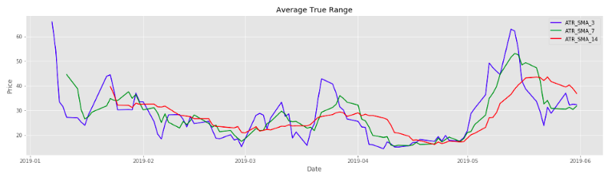

# Historical Stock Data and Basic Analysis for Python Users
This GitHub repo is a companion to a blog I wrote on [Medium](https://medium.com/@cjriggio3/historical-stock-data-and-basic-analysis-for-python-users-f1beb4e9170b) with the same title. The purpose of this blog was to show how to simply pull stock data from Yahoo Finance into a Pandas data frame, calculate average true range and some basic Matplotlib visualizations. 

#### The 3, 7 and 14 day simple moving average for the S&P 500: 

